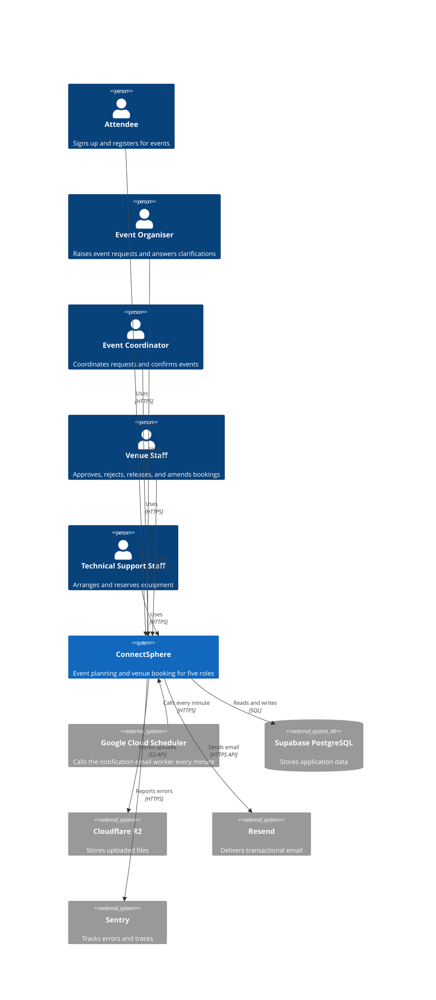
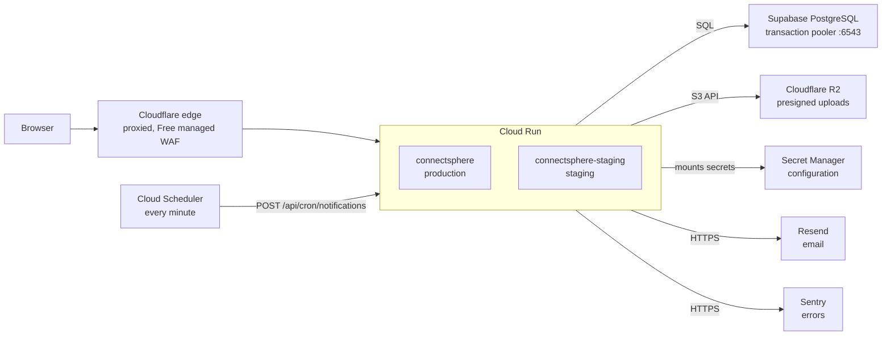
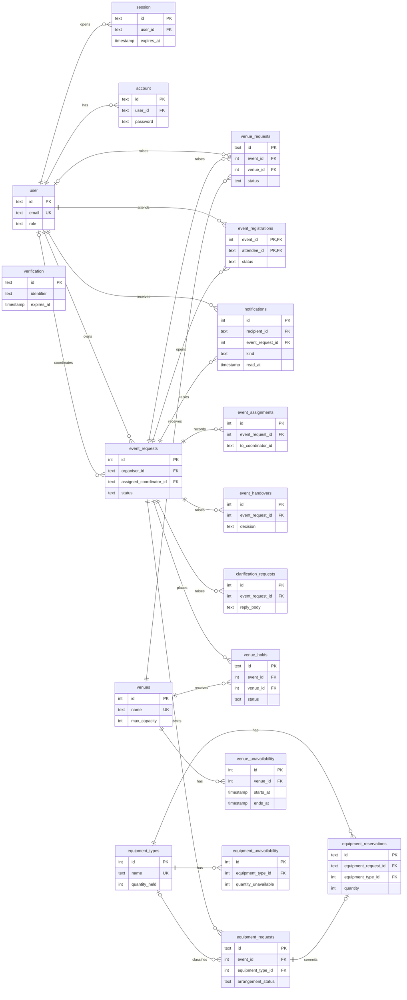

# Architecture

ConnectSphere is a full-stack React application. TanStack Start renders it on the server over Nitro, and the project uses [Bun](https://bun.sh/) throughout.

## System Context

Five roles use ConnectSphere through a browser. The system depends on five external services for data, file storage, email, error tracking, and scheduled work.



## Stack

- **Framework**: [TanStack Start](https://tanstack.com/start). Full-stack React with TanStack Router, server functions, and server-side rendering (SSR).
- **Server**: [Nitro](https://nitro.unjs.io/). Server-side logic and deployment presets.
- **ORM and database**: [Drizzle ORM](https://orm.drizzle.team/) with Bun's native SQL driver (`bun:sql` / `drizzle-orm/bun-sql`) for PostgreSQL, with no extra dependency.
- **Authentication**: [Better Auth](https://better-auth.com/). Email and password authentication with a five-role permission model.
- **Styling**: Tailwind CSS v4 via `@tailwindcss/vite`. The visual system and its tokens are in [`DESIGN.md`](./DESIGN.md).
- **Theme**: [next-themes](https://github.com/pacocoursey/next-themes). Class-based on `html`, with a mounted client toggle.

## Deployment Topology

Both environments run on Google Cloud Run in the project `connectsphere-is212` (`asia-southeast1`), behind the Cloudflare edge. The services share Supabase PostgreSQL, Cloudflare R2, Secret Manager, Resend, and Sentry. [`DEPLOYMENT.md`](./DEPLOYMENT.md#topology) holds the configuration and the release pipeline.



## Decision Records

The reasons for foundational choices are in [`docs/adrs/`](./adrs/):

- [ADR-1: TanStack Start over Next.js or a split frontend–backend app](./adrs/ADR-1-tanstack-start.md)
- [ADR-2: Modular monolith over microservices](./adrs/ADR-2-monolith.md)
- [ADR-3: Google Cloud Run in a single GCP project](./adrs/ADR-3-cloud-run.md)
- [ADR-4: Trunk-based main with release-gated production](./adrs/ADR-4-trunk-based-main.md)
- [ADR-5: Overlap-free approved bookings, enforced by a PostgreSQL exclusion constraint](./adrs/ADR-5-venue-booking-overlap.md)
- [ADR-6: Notification emails from a transactional queue drained by a scheduled worker](./adrs/ADR-6-notification-delivery.md)

## Directory Structure

```
.
├── docs/
│   ├── adrs/             # Architecture decision records
│   ├── ARCHITECTURE.md   # This file
│   ├── CONTRIBUTING.md   # Branch, commit, and test conventions
│   ├── DEPLOYMENT.md     # Environments, release pipeline, local Docker workflow
│   ├── DESIGN.md         # Visual system and tokens
│   └── DEVELOPMENT.md    # Setup, scripts, database, and testing
├── src/
│   ├── components/
│   │   ├── layout/       # Header, the shared page shell and the HTML document shell
│   │   ├── pages/        # Error view and route boundaries
│   │   ├── providers/    # Client providers (theme)
│   │   └── ui/           # Reusable UI primitives (shadcn/ui)
│   ├── db/               # Drizzle schema and generated migrations
│   ├── features/         # One directory per feature: page views under
│   │   │                 # components/, Zod schemas, server functions, and
│   │   │                 # feature-local *.server.ts modules
│   │   ├── auth/         # Sessions, permissions, login/signup/reset/settings
│   │   ├── coordination/ # Coordinator pick-ups of unassigned events, and accepted handovers of assigned ones
│   │   ├── dashboard/    # Signed-in home view
│   │   ├── emails/       # Email templates and shared date formatting
│   │   ├── equipment-requests/ # Equipment lines, submission to Technical Support, its arrangement work list, availability checks, and reservations
│   │   ├── event-requests/ # Requirement capture, drafts, submission
│   │   ├── events/       # Relationship-scoped event access
│   │   ├── landing/      # Public landing view
│   │   ├── notifications/ # The notification inbox, its queue rows and the delivery worker
│   │   ├── venue-requests/ # Booking requests: raise, withdraw, approve, reject, release, amend, notify
│   │   └── venues/       # Venue catalogue, requirements search with suitability verdicts, and availability
│   ├── hooks/            # Client hooks shared across features
│   ├── lib/              # Shared integrations (auth, mail, storage, logger, SEO)
│   └── routes/           # Routing only: wiring, guards, loaders, metadata
│       ├── __root.tsx    # Metadata, session resolution, shell, error boundaries
│       ├── _authenticated.tsx # Session boundary: children require a sign-in
│       ├── _authenticated/    # dashboard, settings, coordination, event-requests, venues
│       │   ├── equipment-requests/ # Technical Support's work list and per-request arrangement view
│       │   ├── venue-requests/ # Pending booking request queue, detail, approval and rejection
│       │   └── venue-bookings/ # Venue Staff's approved-booking release and amendment view
│       ├── api/          # Better Auth handler, health, smoke, upload-url
│       └── robots[.]txt.ts, sitemap[.]xml.ts
├── tests/                # Vitest and Playwright suites
├── CHANGELOG.md          # Release history
├── instrument.server.mjs # Server process preload: Sentry init (logging is configured in src/server.ts)
├── AGENTS.md             # Guide for AI agents (CLAUDE.md symlinks to it)
├── components.json       # shadcn/ui configuration
├── Dockerfile
├── drizzle.config.ts
└── package.json
```

## Data Flow

1. **Routing**: TanStack Router. A route module contains wiring only: search validation, guards, loaders, metadata, pending components, and error components. The view is a feature component (`src/features/<feature>/components/<page>-page.tsx`) that takes its route data as props. The route binds the two with `component: () => <Page {...Route.use*()} />`, so the view renders in a unit test without a router. `tests/unit/route-module-boundaries.test.ts` enforces the split.
2. **SSR**: TanStack Start renders the initial HTML through Nitro.
3. **Sessions**: `src/routes/__root.tsx` resolves the session once per navigation in `beforeLoad`, for every route, so the header renders the user in the server markup. `src/routes/_authenticated.tsx` narrows the session to a signed-in user and redirects visitors to `/login`. Its children read the inherited `context.user`, and they do not call `getCurrentUser()` themselves. The role-gated routes repeat a `can()` check in their own `beforeLoad` and redirect on failure. The authentication routes redirect signed-in users to `/dashboard`.
4. **Server functions**: every `createServerFn` is a directly addressable HTTP route, so authorization runs in middleware, never in the route guard or the handler. Handlers do pure database work, with no session lookup and no `can()` of their own. The full model is [Authorization](#authorization).
5. **Client mutations**: browser writes that a form does not own (save a draft, delete an account, sign out, upload) run through `useMutation` (`src/hooks/use-mutation.ts`). That hook is a thin wrapper over React's `useActionState`, and it holds the run's in-flight flag, result, and error. The run receives the last _successful_ result, so a server-assigned draft id reaches the next save without the page storing it.
6. **Authentication flow**: forms in `src/features/auth/components/` call `src/lib/auth-client.ts`. The routes are `/login`, `/signup`, and `/reset-password` (`?token=`).
7. **File uploads**: `src/routes/api/upload-url.ts` generates a presigned PUT URL. The client uploads directly to storage, and the server never proxies file bytes.
8. **Notifications**: a state change that raises a notification inserts one `notifications` row per recipient in its own transaction. The record in the application and the email queue are the same rows. Cloud Scheduler calls the worker on `POST /api/cron/notifications` every minute, and the worker delivers the pending rows and marks them. The reasoning, the failure policy, and the P0 bypass are in [ADR-6](./adrs/ADR-6-notification-delivery.md). Sign-up verification and password reset stay synchronous. `src/lib/auth.server.ts` sends them.

## Database and Migrations

The application accesses PostgreSQL with Drizzle ORM and Bun's native SQL driver (`bun:sql` through `drizzle-orm/bun-sql`).

- **Schemas**: `src/db/schema.ts` holds the application tables and re-exports the authentication tables. `src/db/auth-schema.ts` holds the Better Auth tables: `user` with `role`, `session`, `account`, and `verification`.
- **Migrations**: Drizzle Kit generates migrations into `src/db/drizzle/`. Run `bun run db:generate` after each schema change, and run `bun run db:migrate` to apply the migrations. Never handwrite SQL. The two reviewed exceptions are the `EXCLUDE` constraints that Drizzle cannot express, added with `db:generate --custom`. The first is the booking constraint `venue_requests_no_overlap` (migration 0019). The second is the venue-hold constraint `venue_holds_no_overlap` (migration 0024, with its `IMMUTABLE` `venue_hold_occupies_venue` status wrapper). Both are documented in [ADR-5](./adrs/ADR-5-venue-booking-overlap.md). Workflow: [`DEVELOPMENT.md`](./DEVELOPMENT.md#database-management-and-migrations).

### Entity Relationships

The diagram shows the application tables and their relationships. Better Auth owns `user`, `session`, `account`, and `verification`. It shows the principal relationships only. The history tables store user ids as snapshots, and the diagram omits the secondary staff and venue links.



## Authentication

**Better Auth** handles authentication, rate limited to 20 requests per 60-second window.

- **Email and password**: the sign-up form collects the name, the email, the password, and a role. The browser matches the password confirmation only, and the form never sends the confirmation. Password hashes live in `account.password`. Sign-ups are auto-signed-in, so an unverified user can still sign in.
- **Password policy**: `PasswordSchema` (`src/features/auth/schema/password.ts`) requires 8–128 characters, with a number and a symbol. Better Auth enforces only a length range of its own accord. A `hooks.before` middleware in `src/lib/auth.server.ts` therefore re-applies the full schema to every endpoint that _sets_ a password (`/sign-up/email`, `/reset-password`, `/change-password`). The middleware deliberately excludes `/sign-in/email`, so accounts that predate the policy can still sign in.
- **Email verification**: `emailVerification.sendOnSignUp` mails a link through the `VerificationEmail` template. Better Auth's `/api/auth/verify-email` consumes the link, so the application has no route for it.
- **Password reset**: `/reset-password` sends a link that expires after 1 hour. The emailed callback returns to `/reset-password?token=…`, or to `?error=INVALID_TOKEN` when the token has expired. It does not create a session, and the user signs in afterwards.

## Authorization

### Roles

`user.role` holds one of the five values in `RoleSchema` (`src/features/auth/schema/role.ts`). A person who needs two roles holds two accounts. The column is plain `text` with no CHECK constraint, so the single-role guarantee is not structural. `can()` parses `RoleSchema` and fails closed, so a hand-written `"attendee,event_coordinator"` grants nothing, not both roles.

`SelfAssignableRoleSchema` is the subset that a stranger can pick at registration (`attendee`, `event_organiser`). The Better Auth `role` field's `validator.input` uses that schema, not `RoleSchema`, so a wider role list never widens what a visitor can claim. A `hooks.before` middleware in `src/lib/auth.server.ts` refuses `role` on `/api/auth/update-user` with a 403, so nobody re-grades their own account. `bun run db:seed` (`scripts/seed.ts`) provisions the three internal roles, and no self-service path reaches them.

### Role/function matrix

`src/features/auth/permissions.ts` is the source of truth, and `tests/unit/auth-permissions.test.ts` holds it to this table. Only role-varying functions appear.

| Function                    | Attendee | Event Organiser | Event Coordinator | Venue Staff | Technical Support Staff |
| --------------------------- | :------: | :-------------: | :---------------: | :---------: | :---------------------: |
| `upload:create`             |    —     |       ✅        |        ✅         |     ✅      |           ✅            |
| `event_request:create`      |    —     |       ✅        |         —         |      —      |            —            |
| `event_request:coordinate`  |    —     |        —        |        ✅         |      —      |            —            |
| `venue:read`                |    —     |        —        |        ✅         |     ✅      |           ✅            |
| `venue:search`              |    —     |        —        |        ✅         |      —      |            —            |
| `venue:create`              |    —     |        —        |         —         |     ✅      |            —            |
| `venue:update`              |    —     |        —        |         —         |     ✅      |            —            |
| `venue_request:request`     |    —     |        —        |        ✅         |      —      |            —            |
| `venue_request:read`        |    —     |        —        |         —         |     ✅      |            —            |
| `venue_request:decide`      |    —     |        —        |         —         |     ✅      |            —            |
| `equipment_request:manage`  |    —     |        —        |        ✅         |      —      |            —            |
| `equipment_request:submit`  |    —     |        —        |        ✅         |      —      |            —            |
| `equipment_request:read`    |    —     |        —        |         —         |      —      |           ✅            |
| `equipment_request:arrange` |    —     |        —        |         —         |      —      |           ✅            |
| `equipment:reserve`         |    —     |        —        |         —         |      —      |           ✅            |
| `equipment:release`         |    —     |        —        |         —         |      —      |           ✅            |

### Enforcing it

The permission model uses `createAccessControl` from `better-auth/plugins/access`. Despite the import path, it is **not** a plugin and never goes to `betterAuth({ plugins })`. The team rejected the `admin` plugin. It adds columns that nothing asks for, and it redefines the `role` field that this project owns (it silently disables the sign-up role selector). It also reads a comma-separated string as several roles at once.

`permissions.ts` stays pure data because the browser imports it too. The session-aware half is the middleware pipeline in `src/features/auth/session.ts`. Every server function runs behind that pipeline:

| Layer                  | Enforcement                                                                                                                                                                                                                                                                     |
| ---------------------- | ------------------------------------------------------------------------------------------------------------------------------------------------------------------------------------------------------------------------------------------------------------------------------- |
| **Server functions**   | `.middleware([...])` on every `createServerFn`. `withSession` resolves the session. `requireSession` answers 401, and `requirePermission(...)` answers 403, or takes an accessor where the permission depends on the payload, as `saveVenue`'s create-versus-update split does. |
| **API route handlers** | `src/routes/api/upload-url.ts` calls `can()` beside its session check, the one handler outside the pipeline.                                                                                                                                                                    |
| **Route guards**       | `beforeLoad` redirects and role checks are presentation only. The middleware behind the page repeats the check.                                                                                                                                                                 |
| **The interface**      | Page views ask `can()` of their route's user, for example to choose between the venue form and its read-only view. Hiding a control is presentation, never enforcement.                                                                                                         |

The middleware runs before a server function's own `.validator()`. A refused role therefore gets 403 even for a malformed payload, and a permitted role still gets the first Zod message. The behavioral half is `tests/integration/server-function-authorization.test.ts`: 401 and 403, with the handler never running.

### Refusals

A handler or middleware throws a typed `Error` subclass when it refuses a request: `AuthorizationError` (401 or 403), `NotFoundError` (404), or `ConflictError` (409). The middleware pipeline (`withSession`, `requireSession`, and `requirePermission`) calls `setResponseStatus`, so the HTTP response on the wire carries the matching status code.

Seroval serializes these errors across the network boundary. Callers and SSR reject with a standard `Error` naturally, with no caller-side response unwrapping.

## Observability

LogTape provides the application logger in `src/lib/logger.ts`, configured from `src/server.ts`, so the built server needs no source tree beside it. The console sink prints each event's structured properties after its message. `maskEmail` (`src/lib/utils.ts`) masks email addresses before the logger writes them. The server process preloads `instrument.server.mjs`, which initializes Sentry with:

- `dataCollection` uses a restrictive baseline:
  - user info, cookies, request and response bodies, database query data, and queue arguments are off
  - GraphQL documents and variables, and generative AI (GenAI) inputs and outputs, are off
  - request and response headers and URL query parameters pass through a deny list
- `tracesSampleRate: 0.1`, so Sentry samples 10% of server traces to control cost.

Widen `dataCollection` or raise `tracesSampleRate` only intentionally, after you review your data-handling obligations.
